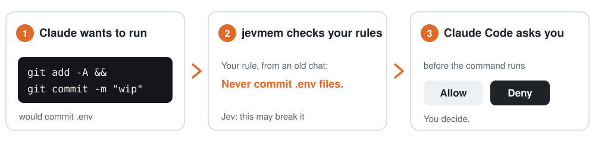

# Can Claude Code check commands against my project's rules before they run?

Yes: with jevmem's guard, before Claude runs a command or edits a file, the call is checked against your saved rules, and if one might break, Claude Code asks you first.

On a held-out test of 274 tool calls, the guard caught 66 of 68 rule breaks, with 3–4 false asks in 206 fine calls (run once on jevmem 0.6.0 and once on 0.6.1, on 2026-09-30: [0.6.0](../../results/guard-heldout-v2-2026-09-30.json), [0.6.1](../../results/guard-heldout-v2-2026-09-30-v061.json)). It is a backstop, not a sandbox: it looks at the words a rule and a call share, so a rule worded far from the command it should catch can be missed.

<picture><source media="(prefers-color-scheme: dark)" srcset="../../docs/img/guard-dark.svg"></picture>

What Claude Code shows you when a call may break a rule:

```text
jevmem: this may break a saved rule: "Never commit .env files" (JEVMEM.md)
```

The guard comes with jevmem 0.6.0 or later: [install](install.md). The rest of this page is the repository's [docs/guardrails.md](https://github.com/Avinash-jetwani/jevmem/blob/main/docs/guardrails.md).

{{include docs/guardrails.md}}
